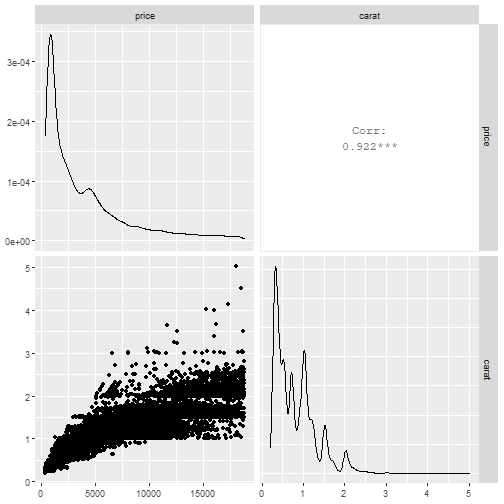
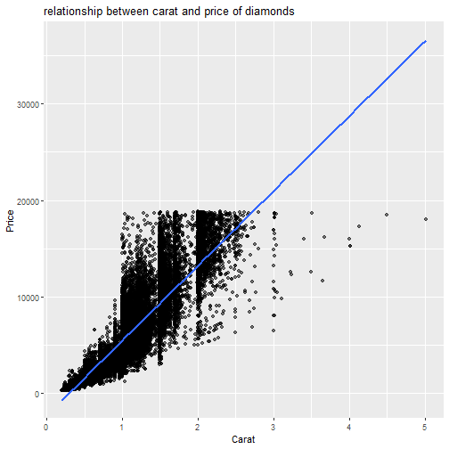

week4_presentation : Diamonds
========================================================
author: Andy
date: Dec 14, 2020
autosize: true


Predict prices of a diamonds
========================================================
  
  
There are some variables to determine prices of diamonds. We can refer to the data set 'diamonds' in the 'ggplot2' package.  
[excerpt description and format from 'R documentation (?diamonds)']    

  
A data frame with 53940 rows and 10 variables:

price   : price in US dollars (\$326???\$18,823)  
carat   : weight of the diamond (0.2???5.01)  
cut     : quality of the cut (Fair, Good, Very Good, Premium, Ideal)  
color   : diamond colour, from D (best) to J (worst)  
clarity : a measurement of how clear the diamond is (I1 (worst), SI2, SI1, VS2, VS1, VVS2, VVS1, IF (best))  
x       : length in mm (0???10.74)  
y       : width in mm (0???58.9)  
z       : depth in mm (0???31.8)  
depth   : total depth percentage = z / mean(x, y) = 2 * z / (x + y) (43???79)  
table   : width of top of diamond relative to widest point (43???95)  


Let's start Explanatory Data Analysis
========================================================


```r
library(tidyverse)
library(GGally)
```


```r
head(diamonds, 1)
```

```
# A tibble: 1 x 10
  carat cut   color clarity depth table price     x     y     z
  <dbl> <ord> <ord> <ord>   <dbl> <dbl> <int> <dbl> <dbl> <dbl>
1  0.23 Ideal E     SI2      61.5    55   326  3.95  3.98  2.43
```

  numeric variables : carat, depth, table, price, x, y, z  
  factor  variables : cut, color, clarity  


```r
diamonds %>% select(price, carat) %>% ggpairs()
```




Build a model
========================================================


```r
mod <- lm(price ~ carat, diamonds)
summary(mod)
```

```

Call:
lm(formula = price ~ carat, data = diamonds)

Residuals:
     Min       1Q   Median       3Q      Max 
-18585.3   -804.8    -18.9    537.4  12731.7 

Coefficients:
            Estimate Std. Error t value Pr(>|t|)    
(Intercept) -2256.36      13.06  -172.8   <2e-16 ***
carat        7756.43      14.07   551.4   <2e-16 ***
---
Signif. codes:  0 '***' 0.001 '**' 0.01 '*' 0.05 '.' 0.1 ' ' 1

Residual standard error: 1549 on 53938 degrees of freedom
Multiple R-squared:  0.8493,	Adjusted R-squared:  0.8493 
F-statistic: 3.041e+05 on 1 and 53938 DF,  p-value: < 2.2e-16
```
Adjusted R-squared of this model is 0.8493.  


Plot
========================================================


```r
diamonds %>% ggplot(aes(x = carat, y = price))+
  geom_point(alpha = 0.5)+
  geom_smooth(method = "lm", se = FALSE)+
  labs(title = "relationship between carat and price of diamonds", x = "Carat", y = "Price")
```




